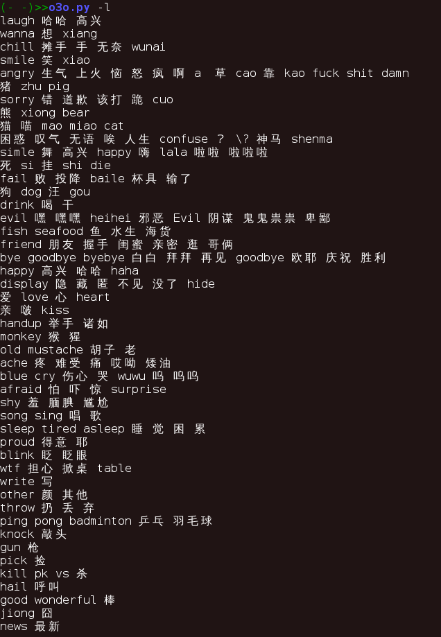

##Pyo3o
This is inspired from [o3o](https://github.com/turingou/o3o)  
A python version  
Just use the yan.json of it  
  
##Dependencies
Python2.4 ~ 2.7
  
##API
```
import o3o
face_cry = o3o.fetch('cry') #you will get the crying related faces within a list
```
  
##Note
if you wanna add o3o.py to you $PATH, you'd better change the path of yan.json with a constant  
Just look at the source code of o3o.py (face_file)  

##Screenshots



